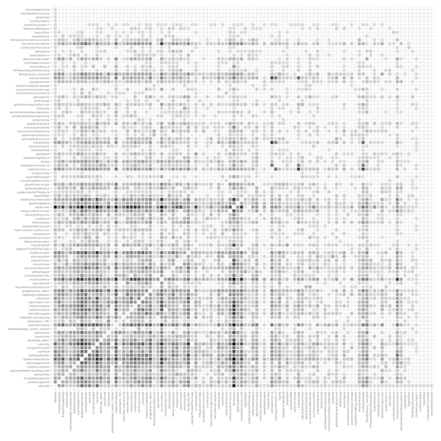

[](charts/bazaar.png?raw=true)

This diagram visualizes top 100 contributors to rails/rails collaborating on other open-source projects on github. Each cell represents two projects that shared some contributors; darker cells indicate that more rails/rails people collaborated in both projects.

This data was pulled from GitHub Archive stored in Google BigQuery. It contains a total number of over 227 * 10^6 events from 2011 till the present day. BigQuery enables querying this huge dataset with a SQL-like language and reasonable performance.
We would start by finding all GitHub users (or actor) that were involved with the rails/rails repository and counting their activities.

```sql
select
  all.actor,
  datediff(all.last_at, all.first_at) as length,
  all.cnt as all, all.cnt_meaningful as meaningful,
  datediff(all.last_at, all.first_at)/all.cnt as freq,
  all.cnt_contributions > 0 as is_contributor,
  all.cnt_contributions as contributions
from
  (SELECT
    actor_attributes_login as actor,
    count(*) as cnt,
    sum(if(type = 'PushEvent' || type = 'CreateEvent' || type = 'PullRequestEvent' || type = 'GollumEvent'
     || type = 'IssueCommentEvent' || type = 'IssuesEvent' || type = 'PullRequestReviewCommentEvent'
     || type = 'CommitCommentEvent' || type = 'MemberEvent' || type = 'ForkApplyEvent', 1, 0)) as cnt_meaningful,
    sum(if(type = 'PushEvent' || type = 'CreateEvent' || type = 'PullRequestEvent' || type = 'GollumEvent', 1, 0)) as cnt_contributions,
    min(created_at) as first_at,
    max(created_at) as last_at
   from
    (SELECT *
     FROM [githubarchive:github.timeline]
     where repository_url = 'https://github.com/rails/rails')
   group by actor) all
where all.cnt > 1 and all.cnt_meaningful >= 1
order by contributions desc
limit 100
```
For our analysis we used only the top 100 contributors (selected by counting their pull requests and push events). BigQuery does not support the `CREATE VIEW` syntax common in other SQL implementations, but offers a similar functionality via the GUI. This view was saved as `[githubdata.rails_actors]`.

Then we looked at other project that those users contributed to. In order to exclude personal projects, only the repositories with at least two contributors were selected.
```sql
-- CREATE VIEW [githubdata.rails_neighbors];
select 'https://github.com/rails/rails' as repository1, t.repository_url as repository2, a.actor as actor, count(*) as cnt
from [githubarchive:github.timeline] t join [githubdata.rails_actors] a on t.actor = a.actor
where t.type = 'PushEvent' || t.type = 'CreateEvent' || t.type = 'PullRequestEvent' || t.type = 'GollumEvent'
and not t.repository_url contains 'https://github.com/rails/rails'
group by repository1, repository2, actor

-- CREATE VIEW [githubdata.rails_true_neighbors]
select ne.repository1, ne.repository2, ne.actor, ne.cnt, count(*) as contributor_cnt from
(
  SELECT n.repository2, t.actor as actor_login
  FROM [githubarchive:github.timeline] t join
    (select repository2 from [githubdata.rails_neighbors] group by repository2) n
  on t.repository_url = n.repository2
  where t.type = 'PushEvent' or t.type = 'PullRequestEvent'
  group by n.repository2, actor_login
) pushers
join [githubdata.rails_neighbors] ne on ne.repository2 = pushers.repository2
group by ne.repository1, ne.repository2, ne.actor, ne.cnt
having contributor_cnt > 1
```
Finally, we looked at the interactions between those projects. For each pair, we counted how many rails/rails contributors also contributed to both of them.
```sql
select repository1, repository2, count(*) as actors_cnt from (
select actors.repository_url as repository1, ti.repository_url as repository2, ti.actor as actor, count(*) as cnt
from [githubarchive:github.timeline] ti
join each
  (
    select t.actor, t.repository_url
    from [githubarchive:github.timeline] t
    join [githubdata.rails_true_neighbors] n on n.repository2 = t.repository_url
    where t.actor in (select actor from [githubdata.rails_actors_contributors])
    group by t.actor, t.repository_url
  ) actors
on ti.actor = actors.actor
where ti.repository_url in (select repository2 from [githubdata.rails_true_neighbors])
and ti.repository_url <> actors.repository_url
and ti.repository_url < actors.repository_url
and not ti.repository_url contains 'https://github.com/rails/rails'
and (ti.type = 'PushEvent' || ti.type = 'CreateEvent' || ti.type = 'PullRequestEvent' || ti.type = 'GollumEvent')
group each by repository1, repository2, actor) x
group by repository1, repository2;
```

The collaboration graph, represented as an weighted edge list, was then saved to csv files. We used R for further analysis and creating the diagram - picking only the 100 most active repositories, converting the graph representation into an adjacency matrix and creating it's graphic representation.
```R
library(igraph)
library(ggplot2)

#cleanup
rails <- read.csv("data/rails_true_neighbors.csv")
rails$repository1 <- substring(rails$repository1, 20)
rails$repository2 <- substring(rails$repository2, 20)
cntrb <- cbind(rails$repository2, rails$contributor_cnt)
rails <- rails[, c("repository1", "repository2", "actors_cnt")]
rbind(cntrb, c("rails/rails", 2049)) -> cntrb
cntrb <- as.data.frame(cntrb)
cntrb$V2 <- as.numeric(as.character(cntrb$V2))
rownames(cntrb) <- cntrb$V1

rails_n <- read.csv("data/rails_network2.csv")
rails_n$repository1 <- substring(rails_n$repository1, 20)
rails_n$repository2 <- substring(rails_n$repository2, 20)
rails_n <- rbind(rails, rails_n)

#create a weighted adjacency matrix representation and pick the most popular repos
GG <- graph.data.frame(rails_n, directed = F)
GG <- set.edge.attribute(GG, "alpha", index=E(GG), value = rails_n$actors_cnt/max(rails_n$actors_cnt))
GG <- induced.subgraph(GG, which(match(V(GG)$name, cntrb$V1[order(cntrb$V2, decreasing = T)][1:100]) > 0))
GG_wgh <- cntrb[V(GG)$name, "V2"]

get.adjacency(GG, attr="alpha") -> mat
dat <- expand.grid(y=seq(nrow(mat)), x=seq(ncol(mat)))
dat <- data.frame(dat, value=as.vector(mat))

#let's see!
ggplot(data=dat, aes(x=x, y=y)) + geom_point(aes(alpha=ifelse(value < 1e-5, 0, value)), size=5, shape=15) -> p1
p1 + scale_x_continuous(breaks=1:100, labels=V(GG)$name, expand = c(0.01, 0.01)) + theme(axis.text.x = element_text(angle = 90, hjust = 1, vjust = 0.5)) -> p1
p1 + scale_y_continuous(breaks=1:100, labels=V(GG)$name, expand = c(0.01, 0.01)) -> p1
p1 + theme(axis.text.y = element_text(hjust = 1), panel.background = element_rect(fill="transparent"), panel.grid.major=element_line(color="#d9d9d9")) -> p1
p1 + labs(x="", y="") + theme(legend.position = "none") + scale_alpha_continuous(range = c(0, 1), guide = "none", trans="sqrt")
```
