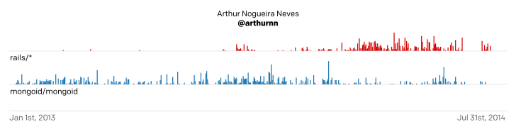
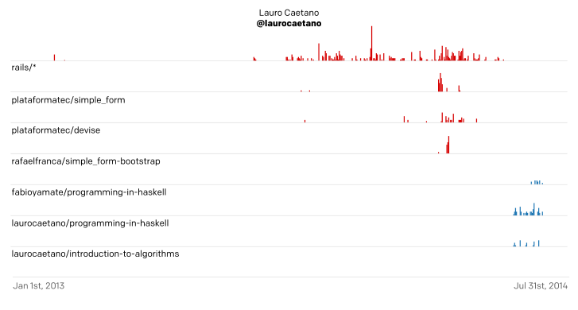
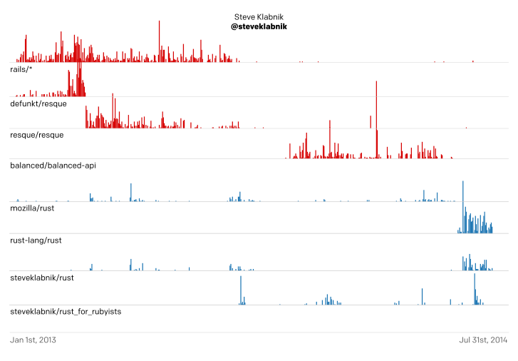
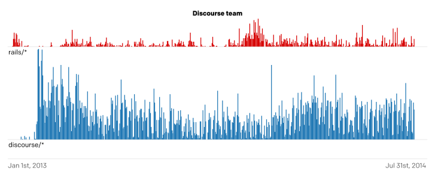
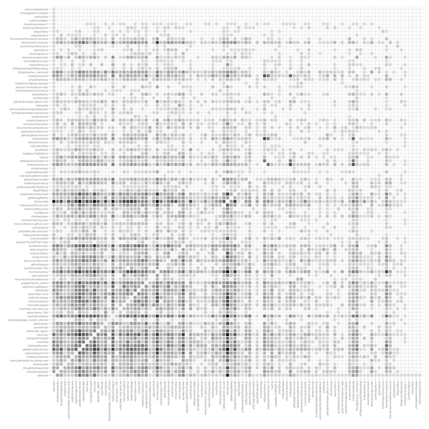

# Knowledge transfer in software projects: exemplary models based on Ruby on Rails community

## Introduction

Our team has grown in the recent months and so the knowledge transfer inside an organization became an important topic for us. We hoped analyzing the GitHub archive could give us more insight into how expertise is shared throughout the open source community. We are Rubyists so we decided to scope the data to Ruby on Rails community and start from there. This experiment was our entry to Third Annual GitHub Data Challenge.

## Method

We analysed top 100 contributors in the [“rails” organization](https://github.com/rails). Contributors where chosen and sorted by the number of [events](https://developer.github.com/v3/activity/events/types/) made throughout its repositories (the 100th person on the list made 62 events). Events include: PullRequestReviewCommentEvent, MemberEvent, PushEvent, CreateEvent, TeamAddEvent, PublicEvent, FollowEvent, WatchEvent, GistEvent, ReleaseEvent, GollumEvent, DeleteEvent, ForkEvent, DownloadEvent, PullRequestEvent, IssuesEvent, IssueCommentEvent and CommitCommentEvent — all other types were left out. Please note we scoped the timeline 18 months back.

## Results

Barcharts represent the total number of events in either all repositories in rails organization (marked as “rails/*”) or events in a specific repository. Repositories related to Ruby on Rails are marked as red, others are blue.

### Example 1: Mongoid comes to Rails

[](charts/arthurnn.pdf?raw=true)

Arthur Nogueira Neves’s knowledge accumulated working on Mongoid shifted to the central [rails/rails](https://github.com/rails/rails) repository and if one dives deeper to specific commits: to the Active Record (ORM in Rails). A database expert knowledge that is now being used in the framework itself.

### Example 2: Leaving Rails

[](charts/laurocaetano.pdf?raw=true)

Lauro Caetano has been an active contributor but on June 3rd he was done and moved to Haskell.

[](charts/steveklabnik.pdf?raw=true)

Steve Klabnik is a famous and even more lively example. Steve has been been an acclaimed top contributor in the Rails community, slowly showed his interest in [Rust language](http://www.rust-lang.org/) and finally transferred his expertise there.

### Example 3: Ongoing contribution

[Discourse](https://github.com/discourse) is a widely-known and heavily-used open source platform built with Ruby on Rails.

The chart below includes all Discourse developers that were active in the Rails community, represented by the number of events in both projects. This includes 422 pull request events, 1819 comments, 197 pushes from the Discourse team into the “rails” organization repositories.

[](charts/discourse_rails.pdf?raw=true)

Discourse is a heartwarming example of how a heavy-traffic application development experiences are given back to the community.

### Rails contributors meeting places

[](charts/bazaar.png?raw=true)

Diagram visualizes top 100 contributors to rails/rails collaborating on other open source projects on GitHub. Each cell represents two projects that shared some contributors; darker cells indicate that more rails/rails people collaborated in both projects. [Learn more](https://github.com/monterail/agora/blob/master/Bazzar.md).


## Closing thoughts

We are confident that the methodology used in this experiment within the scope of Ruby on Rails community can be extended throughout multiple open source projects and analysis can be deepened. Thanks to [GitHub Archive](http://www.githubarchive.org/) the research on transfer of knowledge in the open source community is finally possible and we hope this experiment will help understand the importance of open source in technology in general.

# Running

## Feeding database

**WARNING: Be prepared for ~100GB of data**

Requirements:

- postgresql
- ruby
- clojure

```bash
# create some dir
mkdir path/to/big/hard/drive && cd $_

# download data (this will take some time)
wget http://data.githubarchive.org/201{3..4}-{01..12}-{01..31}-{0..23}.json.gz

# unpack
gunzip *.gz

# create new postgresql database
createdb dbname

# edit database connection details
cd path/to/repo/import
vim src/agora_import/core.clj

# import
lein run path/to/big/hard/drive
```


## Generating graphs

```ruby
cd draw
bundle
export DATABASE_URL=postgres://localhost/dbname?user=dbuser'
ruby users.rb
ruby rails_vs_discourse.rb
```

After that `./draw/graphs` directory will contain SVG files.


# Credits

This experiment was created by Szymon Boniecki, Piotr Sokólski, Tymon Tobolski and Krzysztof Trzewiczek from [Monterail](http://monterail.com/).


